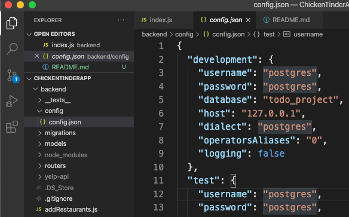
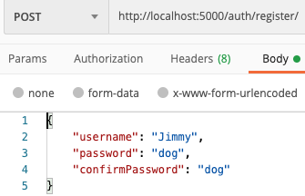

# ChickenTinderApp

This App is similar to Tinder except that you and your friends are swiping on restaurants. When all users match, then that’s what you’re eating! This app will use the Yelp API to pull nearby restaurants. Users can join a group by entering a generated group ID. Users can also send deeplinks to their friends to download the app
## Getting Started

_These instructions will get you a copy of the project up and running on your local machine for development and testing purposes. See deployment for notes on how to deploy the project on a live system._

### Prerequisites(PreSetup)

Things you need to install the software and how to install them

- [Node Installation](https://nodejs.org/en/)

* [PostgreSQL Vedio Link Installation](https://www.youtube.com/watch?v=fZQI7nBu32M)

For JavaSript package manager, In this application we choose to use Yarn, you can install Yarn through the [Homebrew package manager](https://brew.sh/)

```
    brew install yarn
```

### Installing

**Frontend**

```
cd mobile-frontend
yarn
cd ios
pod install
```

**Backend**
```
cd backend
yarn
```

## How to Run this Program

Explain how to run this program in your own machine.

Because we choose to process data with sequelize rather than pure quary, after you clone this project, the first thing you need to do is to go to **backend** folder to find **config** folder then get into **config.json** file to change _username_ and _password_ to your own postgres's _name_ and _password_.

If the file you find it looks like below, you are on correct file.



Then run **two statements**(Very Important):

```
    yarn sequelize db:create
    yarn sequelize db:migrate

```

After these two statements sequelize will automatically create a todo_project database and 6 tables in your postgres. After this, you finish all backend setup.

```bash
    $ cd backend
    $ yarn run dev
```

### Test backend on PostMan

Since this ChickenTinder app has not deployed yet, so you can use postman to test each individual end points.
It will look like below:



## Deployment

Add additional notes about how to deploy this on a live system

## Built with

- Node - An open source server environment
- Express - An Node.js web application framework
- Sequelize - A promise-based ORM for Node.js
- ReactNative - A framework for building native apps using React
- Redux - Frontend state-management uses redux

## Contributing

Pull requests are welcome. For major changes, please open an issue first to discuss what you would like to se make sure to update tests as appropriate.

## Versioning

Current available version: **Version: 1.0.0**

## Authors

| Name     | GitHub                            | Email                      |
| -------- | --------------------------------- | -------------------------- |
| Lev      | https://github.com/LevinWeinstein | lmweinstein@dons.usfca.edu |
| Yuan     | https://github.com/CircularDollar | yqian1@dons.usfca.edu      |
| Zhenzhen | https://github.com/zznw           | zwang211@dons.usfca.edu    |

## License

This project is licensed under the MIT License - see the package.json file in backend folder for details.

## Acknowledgements

- [PERN Stack Course - Postgres, Express, React, and Node](https://www.youtube.com/watch?v=ldYcgPKEZC8&t=193s)
- [Learn Redux on Egghead.io with Dan Abramov](https://egghead.io/courses/getting-started-with-redux)
- [React Native Paper - Lifesaver Preloaded Components!](https://callstack.github.io/react-native-paper/)

